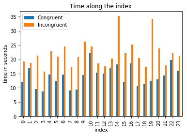
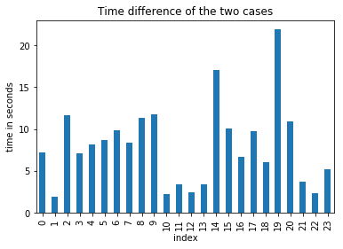
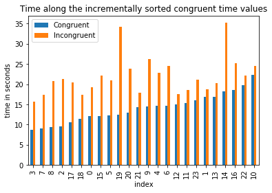

# Statistical Analysis on Stroop Effect Experiment 

* All the functions are composed by the writer
* In mathematical expression, '_' represents 'sub' 

### 1. What is our independent variable? What is our dependent variable?  
    * Independent variable : 'Congruent' or not, in other words True/False on the color word and its color ink match, for example 'red' in red ink is TRUE, 'white' in black ink is FALSE .  
        * So, the independent variable is a categorical data - one of True or False
        * We might be able to turn that into a continuous data. For example, ('white' in grey ink) is distant than ('white' in white ink), and closer than ('white in black ink). Let's say ('white' in white ink) = 0, ('white' in grey ink) = 0.5, ('white' in black ink) = 1. Identical ink color will be 0, complementary ink color will be 1.  
        * Background color might be a lurking variable. 'White' in white ink is invisible.    
    * Dependend variable : time to read all the words during the Stroop experiment 

### 2. What is an appropriate set of hypotheses for this task?        What kind of statistical test do you expect to perform? Justify your choices. 

    * Null hypothesis, H_o : μ_c - μ_inc = 0 
        * Incongruent color-word does not change the time for word recognition of eyes  
    * Alternative hypothesis, H_a : μ_c - μ_inc ≠ 0
        * Incongruent color-word does change the time for word recognition of eyes
        * two-tailed, given that some people may record shorter time for incongruent color words 
    * test type : t-test with two dependent samples. 
        * t-test rather than z-test  
            * Because there is no known population mean and standard deviation for Stroop effect, 
              the experimenter executed 2 paired, before/after test with a condition change(rewriting with incongruent colors) in-between 
              to compare/verify the effect of the change. 
            * Because the count of the paired test is 24, which is limited number to cover the whole population,   
              we cannot extract the population mean and standard deviation from that provided samples 
        * t-test rather than Chi-squared test, ANOVA test 
            * Because the data is continuous and for two groups (1 independent variable) 
        * t-test with two dependent samples, rather than one-sample t-test, independent two samples t-test 
            * There is no known population mean and standard deviation for Stroop effect, so it is not suited for one-sample t-test 
            * 'Congruent' and the subsequent 'Incongruent' test are paired, so it is not independent two samples t-test  

### 3. Report some descriptive statistics regarding this dataset. Include at least one measure of central tendency and at least one measure of variability.  
    * The statistics for each the two samples 
| Statistics | Congruent | Incongruent |
|------------|-----------|-------------|
| mean       | 14.05     | 22.02       |
| std        | 3.56      | 4.8         |
| count      | 24        | 24          |
| max        | 22.33     | 35.26       |
| min        | 8.63      | 15.69       |
    * Every value is unique    
    * There is no NaN 


```python
import pandas as pd
import numpy as np

%matplotlib inline
import matplotlib.pyplot as plt
from IPython.display import display

pd.set_option('display.max_columns', None)  
pd.set_option('display.max_colwidth', -1) 

df = pd.read_csv('stroopdata.csv')
```


```python
""" 
Helper functions for overall understanding of the values of any DataFrame 
- report for NaN proportion, representative values, missing and duplicating values 

Use GetValueComposition to get to know actual data a little closer
Use CountDuplicatesForMustUniqueColumns to investigate the must-unique columns like key or id, name 
Sample codes 
    GetValueComposition(df)
    GetValueComposition(df, 10, False)  # top 10 most frequent unique values and cease plotting 
    CountDuplicatesForMustUniqueColumns(df, 'PassengerId')
"""
def GetNaNdistributionEachColumn(df) : 
    """ Number of Nan proportion and count will be returned   """
    sizedf = pd.DataFrame(df.apply(lambda sr: sr.size)).T
    newindex = sizedf.index.tolist()
    newindex[0] = 'Count.Row'
    sizedf.index = newindex 
    NonNaNdf = pd.DataFrame(df.apply(lambda sr: sr.count())).T
    newindex = NonNaNdf.index.tolist()
    newindex[0] = 'Count.NonNaN'
    NonNaNdf.index = newindex 
    NaNdf = pd.DataFrame(df.isnull().sum()).T 
    newindex = NaNdf.index.tolist()
    newindex[0] = 'Count.NaN'
    NaNdf.index = newindex 
    NaNpropdf = pd.DataFrame(df.isnull().sum()/len(df)).T.applymap(lambda x: round(x,2) if isinstance(x, (int, float, complex)) else x )
    newindex = NaNpropdf.index.tolist()
    newindex[0] = 'NaN Proportion'
    NaNpropdf.index = newindex 
    return pd.concat([sizedf, NonNaNdf, NaNdf, NaNpropdf], axis=0) 
def GetUniqueValuesCountForEachColumn(df) : 
    """ Unique values for each column"""
    uniquedf = pd.DataFrame(df.apply(lambda sr: len(sr.unique()))).T
    newindex = uniquedf.index.tolist()
    newindex[0] = 'Unique Values Count'
    uniquedf.index = newindex 
    return uniquedf
def GetTopUniqueValuesForEachColumn(df, TopN) : 
    """ Top N, frequent values. Obviously do not use on continuous columns """
    retdf = pd.DataFrame(df.apply(lambda sr: sr.value_counts().iloc[:TopN].to_json())).T   # result as json format
    newindex = retdf.index.tolist()
    newindex[0] = 'Unique Values Top {}'.format(TopN)
    retdf.index = newindex 
    return retdf

def GetValueComposition(df, TopN = 5, DrawPlot = True) :
    """ Top level function to get to know the values of each column holistically"""
    NanDF = GetNaNdistributionEachColumn(df)
    # Nan proportion plot 
    if DrawPlot : 
        X = NanDF.columns
        Y = NanDF.loc['NaN Proportion'] # or .iloc[3]
        plt.figure(1) 
        plt.xticks(range(len(X)), X)
        plt.bar(range(len(X)), Y)
        plt.suptitle("NaN proportion of each column", fontsize=16)
        locs, labels = plt.xticks()
        plt.setp(labels, rotation=90)
        plt.ylabel('NaN proportion')
        plt.show()
    DescDF = df.describe().applymap(lambda x: round(x,2) if isinstance(x, (int, float, complex)) else x )
    def display_pretty(df):
        """ Erase NaN and add 'new line' between the values """
        from IPython.display import display, HTML
        display( HTML( df.to_html().replace("|","<br>").replace(",", "<br>").replace("{", "").replace("}", "") ) )
    display_pretty(pd.concat([NanDF, GetUniqueValuesCountForEachColumn(df), GetTopUniqueValuesForEachColumn(df, TopN), DescDF], axis=0)) 

def CountDuplicatesForMustUniqueColumns(df, MustUniqueColumnList ) :
    """ checking duplicated row for Must-Unique columns"""
    if type(MustUniqueColumnList) != type([]) : MustUniqueColumnList = [MustUniqueColumnList]
    dupdf = df[MustUniqueColumnList].loc[df.duplicated(MustUniqueColumnList)]
    grpdf = dupdf.groupby(MustUniqueColumnList).count()
    DupCnt = len(grpdf)
    if DupCnt > 0 : 
        print( "{} group(s) of duplicated rows found for the must-unique column (".format(DupCnt) + ' '.join(str(e) for e in MustUniqueColumnList) 
              + "), values = " + str(grpdf.to_records().tolist())    )
    else : print( "No duplication in the column - " + ' '.join(str(e) for e in MustUniqueColumnList) )

###########################################
GetValueComposition(df, 10, False)
```


<table border="1" class="dataframe">
  <thead>
    <tr style="text-align: right;">
      <th></th>
      <th>Congruent</th>
      <th>Incongruent</th>
    </tr>
  </thead>
  <tbody>
    <tr>
      <th>Count.Row</th>
      <td>24</td>
      <td>24</td>
    </tr>
    <tr>
      <th>Count.NonNaN</th>
      <td>24</td>
      <td>24</td>
    </tr>
    <tr>
      <th>Count.NaN</th>
      <td>0</td>
      <td>0</td>
    </tr>
    <tr>
      <th>NaN Proportion</th>
      <td>0</td>
      <td>0</td>
    </tr>
    <tr>
      <th>Unique Values Count</th>
      <td>24</td>
      <td>24</td>
    </tr>
    <tr>
      <th>Unique Values Top 10</th>
      <td>"8.987":1<br>"12.944":1<br>"18.495":1<br>"8.63":1<br>"12.079":1<br>"14.233":1<br>"12.369":1<br>"14.669":1<br>"18.2":1<br>"16.004":1</td>
      <td>"17.96":1<br>"18.741":1<br>"20.429":1<br>"22.158":1<br>"20.33":1<br>"18.644":1<br>"15.687":1<br>"20.762":1<br>"24.572":1<br>"22.803":1</td>
    </tr>
    <tr>
      <th>count</th>
      <td>24</td>
      <td>24</td>
    </tr>
    <tr>
      <th>mean</th>
      <td>14.05</td>
      <td>22.02</td>
    </tr>
    <tr>
      <th>std</th>
      <td>3.56</td>
      <td>4.8</td>
    </tr>
    <tr>
      <th>min</th>
      <td>8.63</td>
      <td>15.69</td>
    </tr>
    <tr>
      <th>25%</th>
      <td>11.9</td>
      <td>18.72</td>
    </tr>
    <tr>
      <th>50%</th>
      <td>14.36</td>
      <td>21.02</td>
    </tr>
    <tr>
      <th>75%</th>
      <td>16.2</td>
      <td>24.05</td>
    </tr>
    <tr>
      <th>max</th>
      <td>22.33</td>
      <td>35.26</td>
    </tr>
  </tbody>
</table>


### 4. Provide one or two visualizations that show the distribution of the sample data. Write one or two sentences noting what you observe about the plot or plots.
    * The bar graph says Ingrudent values are greater than Congruent values in all cases  
    * Not much patterns were detected, for example I expected the incongruent time value would increase much more as congruent time value increases.  There is no such pattern  


```python
ax = df.plot(kind='bar', title='Time along the index')
ax.set_xlabel("index")
ax.set_ylabel('time in seconds')
plt.show() 
ax = ( - (df['Congruent'] - df['Incongruent'])).plot(kind='bar', title='Time difference of the two cases')
ax.set_xlabel("index")
ax.set_ylabel('time in seconds')
plt.show()
ax = df.sort_values('Congruent' , axis=0, ascending=True, inplace=False).plot(kind='bar', title='Time along the incrementally sorted congruent time values')
ax.set_xlabel("index")
ax.set_ylabel('time in seconds')
plt.show()
```











### 5. Now, perform the statistical test and report your results. What is your confidence level and your critical statistic value? Do you reject the null hypothesis or fail to reject it? Come to a conclusion in terms of the experiment task. Did the results match up with your expectations?
    * t(23) = -8.02, p<.01, two-tailed, the null hypothesis is rejected at alpha level = .01 (t-critical = -2.807). 
    * Conclusion : 'Incongruent color slows down perception of the color word'  
       p-value is lower than alpha level, which means the experiment result can not take place in random circumstances. 
    * t-value : -8.02,  degree of freedom : 23, t-critical for alpha level 0.01 : -2.807, p-value : 0.0000   


```python
"""
Helper functions for t-Test with dependent two samples 

Sample codes 
    TTestDependent(df, 'Congruent', 'Incongruent')
    TTestDependent(df, 'Congruent', 'Incongruent', twotailed = False)
    TTestDependent(df, 'Congruent', 'Incongruent', False)
"""
def TTestDependent(df, bfCol, afCol, twotailed=True) :    
    """  """
    # input verification
    if df[bfCol].count() != df[afCol].count()  : 
        print('Two columns have different counts. Quitting')
        return 'Failed'
    
    # calculations
    df['diff'] = df[bfCol] - df[afCol]
    MeanOfDiff = df['diff'].mean()
    std = (((df['diff']-MeanOfDiff)**2).sum()/(df[bfCol].count()-1))**(0.5)
    SE = std/(df[bfCol].count())**(0.5) 
    T = MeanOfDiff/SE
    DoF = df[bfCol].count() - 1
    df.drop('diff', axis=1, inplace=True)
    import scipy.stats as st
    def GetPvalue(t, dof, twotailed=True) :
        pval = 0
        if twotailed == True : pval = st.t.sf(x= np.abs(t), df=dof) * 2   # Mupltiply by two for two tailed test
        else :      pval = st.t.sf(x= np.abs(t), df=dof)    
        return round(pval,4)
    P = GetPvalue(T, DoF, twotailed)
    
    # display
    resultdf = pd.DataFrame( { 'MeanOfDiff': [MeanOfDiff], 'SE': [SE], 'DoF': [DoF], 'T':[T], 'P':[P] } )
    newindex = resultdf.index.tolist()
    if twotailed == True : newindex[0] = 'value (2-tailed)'
    else : newindex[0] = 'value (1-tailed)'
    resultdf.index = newindex 
    display(resultdf[['MeanOfDiff', 'SE', 'DoF', 'T', 'P']])

    return P

#####################################
TTestDependent(df, 'Congruent', 'Incongruent')
```


<div>
<table border="1" class="dataframe">
  <thead>
    <tr style="text-align: right;">
      <th></th>
      <th>MeanOfDiff</th>
      <th>SE</th>
      <th>DoF</th>
      <th>T</th>
      <th>P</th>
    </tr>
  </thead>
  <tbody>
    <tr>
      <th>value (2-tailed)</th>
      <td>-7.964792</td>
      <td>0.993029</td>
      <td>23</td>
      <td>-8.020707</td>
      <td>0.0</td>
    </tr>
  </tbody>
</table>
</div>


    0.0


### 6. What do you think is responsible for the effects observed? Can you think of an alternative or similar task that would result in a similar effect?  
    * The measurement of dependent variable assumes that 'speaking out' as the timing of 'perception'. When I think of 'speaking out', it is comprised of 1) perception of eyes and informing to brain  2) brain's interpretation of the data 3) brain's start of the speaking. So the slowing down effect might be influenced not by 1), but by 2) 3). For example, it could happen that the perception was all the same in every test but there were 'hesitation' before triggering speaking action when the subjects try to speak the word out loud, due to such as the more thinking of the inconsistency of the meaning of the word and actual color.   
    
    And other unorganized thoughts 
    * How much could the gap be? is there any upper limit? I have interest in people with bigger difference between 'Congruent' and 'Incongruent', why would they experience such long time?  
    * Influence of the background color  
    * Test in other languages. Could there be languages of wider or slimmer difference?  
    * Test with multiple words pointing the same color. For example if there is another language's word 'rrr' meaning red, and luckily that langauge is another vocabulary 'kkk' referring to the same color in that culture. Experiment using 'rrr' and 'kkk', could there be much difference? 
    * Test for bilingual people. 

### Reference 
* t-score table : https://www.medcalc.org/manual/t-distribution.php 


```python
from IPython.display import HTML
HTML('''<script>
code_show=true; 
function code_toggle() {
 if (code_show){
 $('div.input').hide();
 } else {
 $('div.input').show();
 }
 code_show = !code_show
} 
$( document ).ready(code_toggle);
</script>
<li>To show/hide the raw python code, click <a href="javascript:code_toggle()">here</a>.  
The raw code for this IPython notebook is by default hidden for easier reading.</li>''')  
```


<script>
code_show=true; 
function code_toggle() {
 if (code_show){
 $('div.input').hide();
 } else {
 $('div.input').show();
 }
 code_show = !code_show
} 
$( document ).ready(code_toggle);
</script>
<li>To show/hide the raw python code, click <a href="javascript:code_toggle()">here</a>.  
The raw code for this IPython notebook is by default hidden for easier reading.</li>


